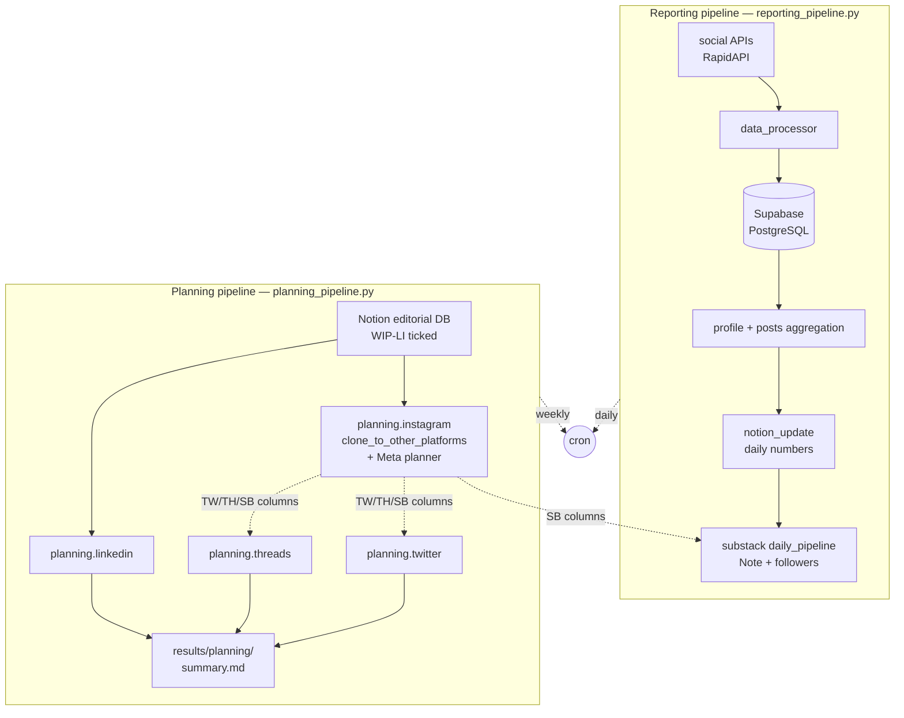
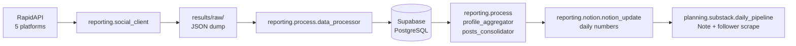

# Social Media Automation Suite

Two pipelines, one repo:

- **Reporting** (`reporting/`, `reporting_pipeline.py`) — pulls daily
  metrics from social media APIs, processes through Supabase, syncs to
  Notion, and runs the daily Substack Note.
- **Planning** (`planning/`, `planning_pipeline.py`) — schedules next
  week's (or weeks') content on LinkedIn, Instagram (+ Meta planner story
  + post), Twitter, Threads, and the weekly **video** clip (cross-platform
  LI/IG/TW/TH at 19:00 Madrid + a Substack video Note posted by the daily
  pipeline). Each platform's native scheduler is driven via real Chrome
  with a dedicated profile. The Instagram step also clones captions /
  illustrations into the TW/TH/SB Notion columns so the other planners
  and the daily Substack run can consume them.

Both pipelines read from the same Notion editorial database. Each per-folder
README has its own mermaid flowchart, CLI table, gotchas, and validated
selector list — this README is the orientation map.



## Supported platforms

LinkedIn · Instagram · Twitter/X · Threads · Substack (Note + scraped
follower count). All five have a Notion editorial column set; four have a
native-scheduler driver under `planning/`.

## Project structure

```
reporting/                            # repo root
├── planning/                         # weekly publishing — drives platform schedulers
│   ├── linkedin/                     # LinkedIn weekly post scheduler
│   ├── instagram/                    # Meta planner (story + post) + IG→TW/TH/SB clone step
│   ├── twitter/                      # X /home composer scheduler
│   ├── threads/                      # threads.com composer + calendar scheduler
│   ├── substack/                     # Substack Note publisher + followers scraper
│   │                                 # (with a video-day branch for the weekly clip)
│   └── videos/                       # weekly cross-platform video orchestrator
├── reporting/                        # daily numbers — APIs → Supabase → Notion
│   ├── social_client/                # RapidAPI fetchers
│   ├── process/                      # transform, upload to Supabase, aggregate
│   └── notion/                       # editorial helpers + Notion sync
├── config/                           # config.json, mapping.json, logger_config, chrome_launch
├── results/                          # outputs — planning summaries + raw API JSON
├── logs/                             # per-module .log files
├── docs/                             # retrospective changelogs (gitignored locally)
├── planning_pipeline.py              # orchestrator: LI → IG → TW → TH (--all-wip)
├── reporting_pipeline.py             # orchestrator: APIs → Supabase → Notion → Substack
├── launch_planning.bat               # planning launcher (Windows CMD)
└── launch_reporting.bat              # reporting launcher (Windows CMD)
```

### Per-folder READMEs

Each folder has a README with a consistent shape: workflow mermaid, CLI table,
Notion field map (where relevant), validated selectors (planning packages),
gotchas, files.

- **Planning** —
  [`planning/linkedin/README.md`](planning/linkedin/README.md) ·
  [`planning/instagram/README.md`](planning/instagram/README.md) ·
  [`planning/twitter/README.md`](planning/twitter/README.md) ·
  [`planning/threads/README.md`](planning/threads/README.md) ·
  [`planning/substack/README.md`](planning/substack/README.md) ·
  [`planning/videos/README.md`](planning/videos/README.md)
- **Reporting** —
  [`reporting/social_client/README.md`](reporting/social_client/README.md) ·
  [`reporting/process/README.md`](reporting/process/README.md) ·
  [`reporting/notion/README.md`](reporting/notion/README.md)
- **Shared** — [`config/README.md`](config/README.md)

## The two launchers

The launchers are the user entrypoints. They wrap the two orchestrators with
the venv interpreter and keep the CMD window open at the end so you can
inspect the output.

| Launcher                  | Pipeline   | Default mode  | Cron-friendly arg |
|---------------------------|------------|---------------|-------------------|
| `launch_reporting.bat`    | Reporting  | interactive   | `auto`            |
| `launch_planning.bat`     | Planning   | dry-run       | `live`, `auto`    |

```powershell
# One-shot, daily numbers pipeline (today's date, no prompts)
.\launch_reporting.bat auto

# Walk every WIP planning row across LI → IG → TW → TH (LIVE), no pause at end
.\launch_planning.bat live auto
```

## Planning pipeline — overview

```mermaid
flowchart LR
    A[Notion editorial DB<br/>WIP-* checkboxes] --> B[planning_pipeline.py<br/>--all-wip]
    B --> L[planning.linkedin<br/>schedule_linkedin_posts]
    L --> I[planning.instagram<br/>schedule_instagram_posts<br/>story + post]
    I --> T[planning.twitter<br/>schedule_twitter_posts]
    T --> H[planning.threads<br/>schedule_threads_posts]
    H --> V[planning.videos<br/>schedule_videos_posts<br/>LI+IG+TW+TH at 19:00]
    V --> S[results/planning/<br/>YYYY-MM-DD-summary.md]
    S --> R[stdout + on-disk report]
```



The weekly **video** package shares one Notion clip page across all four
scheduled platforms (LI/IG/TW/TH) plus the daily Substack pipeline's video-day
branch, and demonstrates three patterns reusable for any future long-form
LinkedIn scheduling work (e.g. posts-DB-driven long-form posts): reading
post body text from a single Notion `code` block (caching the result into a
`TextLI` rich_text property), resolving `@FirstName Last` mentions through
LinkedIn's typeahead dropdown, and waiting for LinkedIn's background
video-upload to settle after the composer closes. See
[`planning/videos/README.md`](planning/videos/README.md) and the *"Reading
post body text from Notion"*, *"Resolving @mentions"*, *"Waiting for the
post-Schedule upload-complete signal"* sections in
[`planning/linkedin/README.md`](planning/linkedin/README.md) for the
canonical write-ups.

- Each platform is run with `--all-wip` — no date filter, so you can plan
  one, two, or three weeks in a single run.
- **Continue-on-error across platforms** — a LinkedIn failure does not
  stop IG / TW / TH. Every failure is captured in the final markdown
  summary.
- On a successful LIVE schedule for a row, the corresponding
  `Work in Progress <P>` checkbox is unticked in Notion so re-runs are
  idempotent no-ops.
- Each platform package owns its own dedicated Chrome profile under
  `planning/<P>/chrome_user_data/` (gitignored). One-time bootstrap per
  platform: `python -m planning.<P>.bootstrap_session`.

## Reporting pipeline — overview



- Idempotent upserts: re-running for the same date is a no-op.
- All six steps run as one script (`reporting_pipeline.py`) with
  per-step `--skip-*` flags for partial reruns.

## Quick Start

### Prerequisites

- Python 3.11+ (tested on 3.14)
- PostgreSQL database (local or Supabase cloud)
- API keys for social media platforms (via RapidAPI)
- Notion API token
- Real Chrome (used by planning Playwright drivers, channel="chrome")

### Installation

```powershell
git clone <repository-url>
cd reporting

# Create venv and install
python -m venv .venv
& .\.venv\Scripts\python.exe -m pip install -r requirements.txt

# Configure
Copy-Item config\config_example.json config\config.json
# edit config\config.json with API keys, Notion token, DB credentials

# One-time per-platform browser session bootstrap (interactive login):
& .\.venv\Scripts\python.exe -m planning.linkedin.bootstrap_session
& .\.venv\Scripts\python.exe -m planning.instagram.bootstrap_session
& .\.venv\Scripts\python.exe -m planning.twitter.bootstrap_session
& .\.venv\Scripts\python.exe -m planning.threads.bootstrap_session
& .\.venv\Scripts\python.exe -m planning.substack.bootstrap_session
# planning.videos reuses the four sister sessions above — no separate bootstrap.
```

### Daily reporting run

```powershell
.\launch_reporting.bat auto
# OR per-step:
& .\.venv\Scripts\python.exe reporting_pipeline.py --date 20260517 --yes
& .\.venv\Scripts\python.exe reporting_pipeline.py --date 20260517 --yes --skip-substack
```

### Weekly planning run

```powershell
# After filling the Notion IG side and ticking WIP-IG / WIP-LI for next week:
.\launch_planning.bat live auto
# Dry-run rehearsal (no posts scheduled):
.\launch_planning.bat
```

## 📊 Data Schema & Structure

### Database Architecture

The system uses PostgreSQL (via Supabase) with a normalized schema that separates raw data collection from aggregated analytics. All tables use `date` as the primary key for efficient time-series queries.

### Raw Data Tables

The system creates individual tables for each platform and data type to store raw API responses:

#### Profile Tables
- **`linkedin_profile`**: LinkedIn follower counts and profile data
- **`instagram_profile`**: Instagram follower counts and profile data
- **`twitter_profile`**: Twitter/X follower counts and profile data
- **`threads_profile`**: Threads follower counts and profile data
- **`substack_profile`**: Substack subscriber counts and profile data

**Common Profile Fields:**
- `date` (date, PRIMARY KEY): Date of data collection
- `platform` (text): Platform identifier
- `data_type` (text): Data type identifier ('profile')
- `num_followers` (integer): Number of followers/subscribers

#### Posts Tables
- **`linkedin_posts`**: LinkedIn post performance metrics
- **`instagram_posts`**: Instagram post performance metrics
- **`twitter_posts`**: Twitter/X post performance metrics
- **`threads_posts`**: Threads post performance metrics
- **`substack_posts`**: Substack post performance metrics

**Common Posts Fields:**
- `date` (date, PRIMARY KEY): Date of data collection
- `platform` (text): Platform identifier
- `data_type` (text): Data type identifier ('posts')
- `post_id` (text): Unique post identifier
- `posted_at` (date): Date when post was published
- `is_video` (integer): Boolean flag (1 for video, 0 for non-video)
- `num_likes` (integer): Number of likes/reactions
- `num_comments` (integer): Number of comments
- `num_reshares` (integer): Number of reshares/reposts

### Aggregated Tables

#### Profile Summary Table
**`profile`** - Consolidated daily follower counts across all platforms:
- `date` (date, PRIMARY KEY): Date of data collection
- `num_followers_linkedin` (integer): LinkedIn follower count
- `num_followers_instagram` (integer): Instagram follower count
- `num_followers_twitter` (integer): Twitter follower count
- `num_followers_substack` (integer): Substack subscriber count
- `num_followers_threads` (integer): Threads follower count

#### Posts Summary Table
**`posts`** - Daily post performance metrics separated by content type:
- `date` (date, PRIMARY KEY): Date of data collection

**Non-Video Posts (by platform):**
- `post_id_*_no_video`: Post ID for latest non-video content
- `posted_at_*_no_video`: Publication date
- `num_likes_*_no_video`: Engagement metrics
- `num_comments_*_no_video`: Comment counts
- `num_reshares_*_no_video`: Share counts

**Video Posts (by platform):**
- `post_id_*_video`: Post ID for latest video content
- `posted_at_*_video`: Publication date
- `num_likes_*_video`: Engagement metrics
- `num_comments_*_video`: Comment counts
- `num_reshares_*_video`: Share counts

*(* = linkedin, instagram, twitter, substack, threads)

## 🗄️ Database Architecture & Integration

### Two-Stage Data Pipeline

The system implements a sophisticated two-stage data pipeline designed for scalability and analysis:

#### Stage 1: Raw Data Ingestion
**Social Media Data:**
- Platform-specific tables store raw API responses
- Automatic table creation based on data structure
- Preserves original data integrity before transformation

**Notion Integration:**
- Dynamic schema detection from Notion databases
- Bidirectional sync with change tracking
- Complex data types stored as JSONB for flexibility

#### Stage 2: Data Consolidation
- SQL aggregation scripts process raw data into analysis-ready tables
- Platform-specific data merged into unified views
- Optimized for time-series analysis and cross-platform comparisons

### Notion Database Integration

#### Common Notion Table Structure
All Notion-synced tables share standardized columns:

| Column | Data Type | Description |
| :--- | :--- | :--- |
| `notion_id` | `text` | Notion page ID (UUID) - **Primary Key** |
| `created_time` | `timestamp with time zone` | When page was created in Notion |
| `last_edited_time` | `timestamp with time zone` | When page was last edited |
| `archived` | `boolean` | Whether page is archived |
| `notion_data_jsonb` | `jsonb` | Complex data types and unmapped properties |

#### Dynamic Schema Generation
Tables are automatically created with columns derived from Notion properties:
- **Property names** → normalized column names (lowercase, underscores)
- **Data types** automatically mapped from Notion to PostgreSQL
- **Complex types** (relations, arrays) stored in JSONB column

#### Notion to PostgreSQL Type Mapping

| Notion Property Type | PostgreSQL Data Type |
| :--- | :--- |
| Title, Rich Text, URL, Email, Phone | `text` |
| Number | `bigint` or `double precision` |
| Select, Status | `text` |
| Date | `timestamp with time zone` |
| Checkbox | `boolean` |
| Formula (various) | Mapped to appropriate types |
| Multi-Select, Relation, People, Files | `jsonb` |

### Integrated Notion Databases

The system syncs data from **15+ Notion databases** for comprehensive content management:

**Content & Publishing:**
- `notion_posts` - Social media posts and content
- `notion_articles` - Blog articles and written content
- `notion_newsletter` - Newsletter content and campaigns

**Media & Assets:**
- `notion_clips` - Video/audio clips and media assets
- `notion_illustrations` - Images and visual content
- `notion_visual_types` - Media categorization

**Business & Analytics:**
- `notion_companies` - Company profiles and relationships
- `notion_connections` - Network and relationship data
- `notion_interactions` - User engagement and interactions

**Content Strategy:**
- `notion_editorial` - Editorial calendar and planning
- `notion_concepts` - Content ideas and brainstorming
- `notion_books` - Book recommendations and reviews
- `notion_books_recommendations` - Reading lists and suggestions

**Additional Databases:**
- `notion_episodes` - Podcast episodes and series
- `notion_comments` - User comments and feedback
- `notion_wins_and_features` - Success metrics and feature tracking

### Database Relationships & Constraints

**Social Media Data:**
- Raw platform tables feed into consolidated tables
- Foreign key relationships based on `date` field
- No traditional foreign keys between Notion tables

**Notion Data:**
- Relationships stored as Notion page ID arrays in JSONB
- Application-layer joins required for complex queries
- Preserves Notion's flexible relationship model

**Data Integrity:**
- Primary keys ensure uniqueness
- Timestamp tracking for change detection
- Archive status management for data lifecycle

## 📈 Analytics & Query Examples

### Growth Analysis Queries

**Monthly follower growth by platform:**
```sql
SELECT
    DATE_TRUNC('month', date) as month,
    platform,
    AVG(num_followers) as avg_followers,
    MAX(num_followers) - MIN(num_followers) as growth
FROM (
    SELECT date, 'linkedin' as platform, num_followers_linkedin as num_followers FROM profile
    UNION ALL
    SELECT date, 'instagram' as platform, num_followers_instagram as num_followers FROM profile
    UNION ALL
    SELECT date, 'twitter' as platform, num_followers_twitter as num_followers FROM profile
) combined
GROUP BY month, platform
ORDER BY month, platform;
```

### Engagement Analysis

**Average engagement by content type and platform:**
```sql
SELECT
    'linkedin' as platform,
    'video' as content_type,
    AVG(num_likes_linkedin_video) as avg_likes,
    AVG(num_comments_linkedin_video) as avg_comments,
    AVG(num_reshares_linkedin_video) as avg_reshares
FROM posts
WHERE num_likes_linkedin_video IS NOT NULL;
```

### Performance Prediction Features

**Features for ML model training:**
```sql
SELECT
    p.date,
    -- Historical performance (7-day average)
    AVG(ps.num_likes_linkedin_no_video) OVER (
        ORDER BY p.date ROWS BETWEEN 7 PRECEDING AND 1 PRECEDING
    ) as avg_likes_7d,
    -- Growth momentum
    p.num_followers_linkedin - LAG(p.num_followers_linkedin, 7) OVER (ORDER BY p.date) as follower_growth_7d,
    -- Engagement rate
    CASE
        WHEN p.num_followers_linkedin > 0
        THEN (ps.num_likes_linkedin_no_video + ps.num_comments_linkedin_no_video) / p.num_followers_linkedin
        ELSE NULL
    END as engagement_rate
FROM profile p
LEFT JOIN posts ps ON p.date = ps.date
WHERE ps.num_likes_linkedin_no_video IS NOT NULL;
```

### Cross-Platform Analysis

**Total audience reach across platforms:**
```sql
SELECT
    date,
    num_followers_linkedin + num_followers_instagram + num_followers_twitter +
    num_followers_substack + num_followers_threads as total_followers,
    -- Engagement rates
    CASE WHEN num_followers_linkedin > 0
         THEN (num_likes_linkedin_no_video + num_comments_linkedin_no_video) / num_followers_linkedin
         ELSE 0 END as linkedin_engagement_rate,
    CASE WHEN num_followers_instagram > 0
         THEN (num_likes_instagram_no_video + num_comments_instagram_no_video) / num_followers_instagram
         ELSE 0 END as instagram_engagement_rate
FROM profile p
LEFT JOIN posts ps ON p.date = ps.date
ORDER BY date DESC;
```

## 🔧 Advanced Configuration

### Debug Mode

Most scripts support debug mode for detailed logging:
```bash
python script_name.py --debug
```

### Environment-Specific Settings

Switch between local and cloud databases:
```bash
python supabase_uploader.py --environment local
```

### Custom Configurations

Override default configuration files:
```bash
python notion_supabase_sync.py --config custom_config.json
```

## 🐛 Troubleshooting

### Common Issues

1. **API Rate Limits**
   - Use `--skip-existing` flag to avoid re-fetching data
   - Implement delays between API calls

2. **Database Connection Errors**
   - Verify credentials in `.env` file
   - Check network connectivity
   - Ensure database is accessible

3. **Missing Data Fields**
   - Review `mapping.json` for correct field paths
   - Enable debug mode to see raw API responses
   - Check if API response structure changed

4. **Notion Sync Issues**
   - Verify Notion API token is valid
   - Check database IDs in configuration
   - Review Notion API rate limits

### Debug Commands

```powershell
# Test database connection
& .\.venv\Scripts\python.exe -m reporting.process.supabase_test_connect

# Analyze Notion database structure
& .\.venv\Scripts\python.exe -m reporting.notion.notion_database_structure --debug

# Process single platform
& .\.venv\Scripts\python.exe -m reporting.social_client.social_api_client --platform linkedin_profile --debug

# Smoke-test one planning scheduler (dry-run, no posts written)
& .\.venv\Scripts\python.exe -m planning.twitter.schedule_twitter_posts --all-wip --dry-run --debug
```

## 📈 Performance Optimization

- **Batch Processing**: Data is processed in batches to handle large datasets
- **Incremental Sync**: Only new/modified data is synced to avoid redundant operations
- **Connection Pooling**: Database connections are pooled for efficiency
- **Smart Caching**: API responses are cached daily to minimize API calls

## 🔐 Security Best Practices

1. **Never commit sensitive data**
   - Keep `config.json` out of version control
   - Use `.env` files for database credentials
   - Rotate API keys regularly

2. **Use environment variables in production**
   ```bash
   export SUPABASE_URL="your-url"
   export SUPABASE_KEY="your-key"
   ```

3. **Implement access controls**
   - Use read-only database users where possible
   - Limit API key permissions
   - Enable Supabase Row Level Security (RLS)

## 🚧 Development

### Adding New Platforms

1. **Update configuration**
   - Add platform config to `config.json`
   - Define field mappings in `mapping.json`

2. **Test data collection**
   ```bash
   python social_api_client.py --platform new_platform --debug
   ```

3. **Verify processing**
   ```bash
   python data_processor.py --debug
   ```

### Extending Functionality

- Create custom processors in the `process` module
- Add new Notion property type handlers
- Implement additional aggregation queries

## 📝 License and contact

This project is free software for personal use from Roberto Ferraro 😇

https://www.linkedin.com/in/ferraroroberto/

Built with ❤️ for automated social media analytics and reporting
