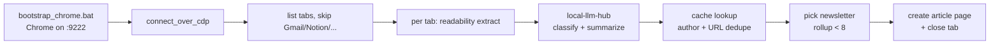

# archive.newsletter — automated newsletter / article archive

Walks the article tabs in your real Chrome, extracts each article, classifies
it into one of three topics, finds (or creates) the author connection, picks
the next future newsletter row with room, writes a Notion article page, and
closes the tab. End state: only Gmail (and other skipped utility tabs)
remain.

Tracks issue: ferraroroberto/reporting#17.

## Workflow



## One-time setup

1. Install new deps:
   ```powershell
   & .\.venv\Scripts\python.exe -m pip install -r requirements.txt
   ```
2. Make sure the local-llm-hub is running:
   `http://127.0.0.1:8000` reachable, `gemini_lite` available.
3. Add the `newsletter_archive` block to `config/config.json` (see
   `config/config_example.json`).
4. **Sign into Gmail in the dedicated newsletter Chrome profile** (one-time):
   ```powershell
   & .\.venv\Scripts\python.exe -m archive.newsletter.bootstrap_session
   ```
   A real Chrome window opens against `archive/newsletter/chrome_user_data/`
   (gitignored, same pattern as `planning/linkedin/chrome_user_data/` etc.).
   Sign into Gmail (and any other newsletter sources you want), then press
   Enter in the terminal to save the session. Future per-day runs reuse it.
5. Make sure a connection named exactly **`(not classified)`** exists in the
   connections DB (with the parentheses). It's the fallback used when the LLM
   can't identify the article author — required so we never invent
   connections. Change the value in `config.newsletter_archive.author_fallback_name`
   if your sentinel uses a different exact string.

## Per-session usage

1. **Close every Chrome window first.** A running Chrome bound to the default
   user-data-dir will silently swallow our `--remote-debugging-port` flag.
2. Launch Chrome:
   ```cmd
   archive\newsletter\bootstrap_chrome.bat
   ```
3. Open your newsletter article tabs in that Chrome window (clicking links
   from Gmail is fine — they'll open there).
4. Dry-run first (no Notion writes, no tab closing):
   ```powershell
   & .\.venv\Scripts\python.exe -m archive.newsletter.dry_run --first-non-gmail-tab --no-write
   ```
5. If the log looks right, repeat without `--no-write` to write one article
   and close that one tab. Or run the full batch:
   ```powershell
   & .\.venv\Scripts\python.exe -m archive.newsletter.pipeline --live
   ```

## CLI

| Command | What it does |
|---|---|
| `python -m archive.newsletter.dry_run --first-non-gmail-tab --no-write` | Reads first eligible tab, prints what would happen. Nothing written. |
| `python -m archive.newsletter.dry_run --single-url <url>` | Same, but pick the tab by URL substring. Writes to Notion + closes the tab unless `--no-write` is also set. |
| `python -m archive.newsletter.dry_run --first-non-gmail-tab` | Live for one tab. |
| `python -m archive.newsletter.pipeline` | Dry-run over **every** eligible tab. |
| `python -m archive.newsletter.pipeline --live` | Live over every eligible tab. Closes each tab on success. |

Add `--debug` for verbose logs. All runs append to `logs/newsletter_archive*.log`.

## Notion field map

| Article DB field | Source |
|---|---|
| `article` (title) | readability `short_title()` (fallback: `<title>`) |
| `link` (url) | tab URL |
| `summary` (rich_text) | LLM 3-line plain text |
| `topic` (select) | LLM classifier (`personal development` / `innovation` / `leadership and management`) |
| `type` (select) | always `article` |
| `author or source` (relation → connections) | see *Author resolution* below |
| `news` (relation → newsletter) | first future newsletter where rollup < 8 |
| page body | extracted article text as paragraph blocks (no images) |

| Newsletter rollup (per topic) | Cap |
|---|---|
| `n persdev` | 8 |
| `n innov` | 8 |
| `n leader` | 8 |

## Author resolution

The resolver in `author_resolver.py` follows this order:

1. **Single clean byline** found in the page (meta tag / OG / byline div):
   fuzzy-match against the connections cache. If a match exists, use it.
   If not, **create a new connection** with that name and the article's
   topic (the byline is trusted because it came from the page itself).
2. **Multiple authors, missing byline, or any ambiguity** (`and` / `,` /
   `&` / `with` in the string): call Gemini-Lite via the LLM hub and ask
   it to identify the primary author OR the publishing organisation
   (Google, Anthropic, McKinsey, Microsoft, ...). Verify the LLM's answer
   against the cache (fuzzy). If matched, use it.
3. If the LLM returns `UNKNOWN` or its answer doesn't match any
   connection, fall back to the connection named **`(not classified)`**
   (configurable via `author_fallback_name`). The article still gets
   saved, just with the fallback author.

We **never** create a connection from LLM output — only from a real
byline. The fallback exists so the pipeline never invents people.

## Gotchas

- **Chrome must be closed first** before running `bootstrap_chrome.bat`,
  otherwise the debug port is ignored.
- The script does **not** spawn Chrome itself and does **not** close Chrome
  when it disconnects — it only closes the tabs whose articles it processed
  successfully.
- New connections are created with just `name` + `topic`. LinkedIn URLs are
  left empty for manual fill — auto LinkedIn search is deliberately out of
  v1 scope.
- Fuzzy author match: `rapidfuzz.token_sort_ratio >= 88`. Tweak via
  `fuzzy_author_threshold` in config.
- URL dedupe strips `utm_*` / `mc_*` / `_hsenc` / `_hsmi` / `ref` / `gclid`
  / `fbclid` and trailing slashes before comparing. See
  `cache.canonicalize_url`.
- Cache is in-memory per run only. Notion is the source of truth.

## Files

- `bootstrap_chrome.bat` — daily Chrome launcher (kill + relaunch on `:9222`).
- `bootstrap_session.py` — one-time Gmail-login flow into the dedicated profile.
- `chrome_tabs.py` — CDP attach, list, skip filter, tab close.
- `extractor.py` — Playwright + readability-lxml + meta-tag fallback.
- `llm.py` — local-llm-hub `/v1/messages` wrapper.
- `classifier.py` — topic classifier with validation + fallback.
- `summarizer.py` — 3-line summarizer.
- `author_resolver.py` — byline / LLM-pick-primary / "not classified" fallback.
- `cache.py` — in-memory caches + URL canonicaliser + fuzzy name match.
- `notion_io.py` — DB read/write helpers.
- `pipeline.py` — batch orchestrator.
- `dry_run.py` — single-tab entrypoint.
