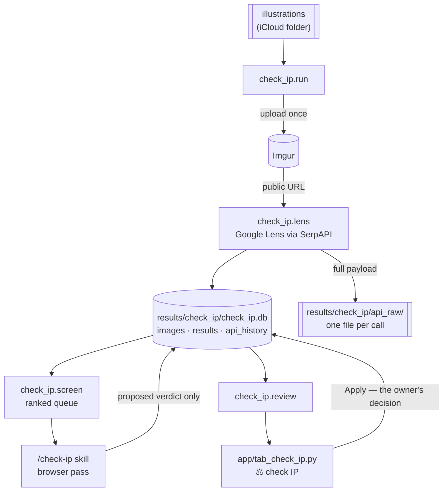

# check_ip — illustration copyright check

Finds where my published illustrations are being reused, and turns that into a
queue I can actually work through.

Every illustration is reverse-image-searched through Google Lens (via SerpAPI).
Every match lands in a local SQLite store. The control panel's **⚖️ check IP**
tab is where each match gets judged — legitimate share, or my work with the
credit stripped off — and the `/check-ip` skill does the boring first pass in a
browser so judging a match is a yes/no rather than an investigation.

Folded in from the sibling `automation` repo's `linkedin/check_ip/`
(issue [#286](https://github.com/ferraroroberto/content-management/issues/286)),
which wrote three Excel workbooks instead.



## The one rule

The store has two sets of decision columns, and they never mix:

| columns | written by | meaning |
|---|---|---|
| `ok` `person` `chat` `report` `fixed` | **the owner only**, via the tab | the verdict and the follow-up trail |
| `screen_credit_ok` `screen_noncommercial_ok` `screen_unmodified_ok` `screen_verdict` `screen_outcome` `screen_reason` `screened_at` `screen_source` `poster_url` | the `/check-ip` skill | a *proposal*, nothing more |

`ok = 0` means "this is an infringement, act on it". `ok = 1` means "reviewed,
acceptable use". The skill cannot write either — `check_ip.screen.record_verdict`
has no code path that touches them, and `tests/test_check_ip_store.py` fails if
one is ever added. That separation is what makes the skill safe to let loose on
a queue of 13,000 links: the worst it can do is propose something wrong.

## Commands

```powershell
# import the legacy Excel store (idempotent — run it twice, nothing changes)
& .\.venv\Scripts\python.exe -m check_ip.migrate --report    # reconcile, write nothing
& .\.venv\Scripts\python.exe -m check_ip.migrate

# reverse-image search — COSTS MONEY, one SerpAPI call per image
& .\.venv\Scripts\python.exe -m check_ip.run --dry-run       # what it would search
& .\.venv\Scripts\python.exe -m check_ip.run --limit 10      # a small live run
& .\.venv\Scripts\python.exe -m check_ip.run                 # everything that is due
& .\.venv\Scripts\python.exe -m check_ip.run --force         # ignore re-search windows

# retire the stored 'Similar Match' rows (issue #292) — flags them, deletes nothing
& .\.venv\Scripts\python.exe -m check_ip.migrate --retire-similar

# re-elect the canonical row of every group (issue #291) — writes only `duplicate`
& .\.venv\Scripts\python.exe -m check_ip.migrate --recompute-duplicates

# map screened rows onto the three licence conditions (issue #295)
& .\.venv\Scripts\python.exe -m check_ip.migrate --assess-conditions

# the screening queue
& .\.venv\Scripts\python.exe -m check_ip.screen stats
& .\.venv\Scripts\python.exe -m check_ip.screen next --limit 10

# no credit, nothing else wrong → severity 1
& .\.venv\Scripts\python.exe -m check_ip.screen verdict --id 123 --verdict infringement `
    --credit violated --noncommercial met --unmodified met --reason "…"

# credited, but it is a company's marketing → still an infringement
& .\.venv\Scripts\python.exe -m check_ip.screen verdict --id 123 --verdict infringement `
    --credit met --noncommercial violated --unmodified met --reason "…"

# the post is gone — permanently unassessable, not "acceptable"
& .\.venv\Scripts\python.exe -m check_ip.screen verdict --id 123 --verdict unclear `
    --outcome nothing_to_assess --reason "…"
```

## Only exact matches count

Google Lens returns two kinds of hit. An **exact match** is the same image file
— that is evidence of reuse. A **similar match** is Lens saying "this looks
like your picture", which for minimalist business illustration means another
artist drawing buckets, staircases and book piles in the same idiom. It is not
reuse and it never was: of 1,277 manual decisions over ten months, **zero** are
on a similar match, and every one the skill ever screened came back `unclear`.

Worse, the category is actively dangerous. Handed ten lookalikes from one
illustrator, the screener built a theory of a serial infringer and re-read its
own earlier verdicts to fit it — nine severity-3 accusations against a peer,
all reverted. Removing the category removes the exposure
([#292](https://github.com/ferraroroberto/content-management/issues/292)).

So: `MATCH_TYPES` no longer maps the `visual_matches` section, a live run skips
that search rather than paying for it, `next_batch` filters on
`match_type = 'Exact Match'`, and the 139,874 stored similar matches are
**retired, not deleted** — `results.retired = 1`, set by
`migrate --retire-similar`, reversible with one `update`. Each of those rows
cost a SerpAPI call and could not be re-derived without paying again.

A retired row is out of the queue, out of the tab and out of every `screen
stats` total except `retired`, which prints its reason next to it. A row
carrying an owner annotation is **never** retired, so no decision can vanish
from the tab — there are none today, and the guard is what keeps it that way.

## One post, many URLs

LinkedIn serves the same post under a host per country — `www.`, `tn.`, `my.`,
`rs.`, … — and X under `?lang=`. Those are different strings for one page, so
the duplicate flag never fired on them and the queue served the post once per
mirror: one live batch of ten rows held five distinct posts
([#291](https://github.com/ferraroroberto/content-management/issues/291)).

`db.canonical_link_for()` builds the dedupe key `mark_duplicates` groups on:
lowercase host and path, a LinkedIn locale host folded onto `www.`, no
fragment, no trailing slash, and the locale/tracking query parameters dropped.
**The query is not dropped wholesale** — measured against the live store first,
that would have merged 3,913 distinct YouTube videos (`?v=`) and 2,324 distinct
Facebook photos (`?fbid=`) into one row each, so it is a denylist of the
parameters that only ever carry a locale or a referrer breadcrumb.

`found_link` is never rewritten: the stored URL stays the one that was actually
found and opened, and only the `duplicate` flag moves.

Which row wins the group matters once the group spans mirrors, so the primary
is **elected**: a live row before a retired one, a row the owner annotated
before one he has not, a screened row before an unscreened one, then the
original oldest-first ordering. Without that, a mirror could take the primary
slot from the row carrying the verdict and the post would come back through the
queue as a different row while the verdict sat on a row nobody serves. Across
the live store the pass folded 4,353 canonical rows away, took 3,301 rows out
of the pending queue, returned 16 annotated rows to the tab, and left every
verdict, every annotation and every stored URL byte-identical.

## Three licence conditions, not one

The illustrations are published under **CC BY-NC-ND 4.0**
([robertoferraro.net/art](https://robertoferraro.net/art)), which is three
conditions that must *all* hold. Each has its own column with the same polarity
— `1` met, `0` violated, **`NULL` not assessed**:

| column | condition | met when |
|---|---|---|
| `screen_credit_ok` | **BY** — attribution | the post names me, tags me, links to the original, my own comment claims it, or it is a reshare carrying the original credited caption |
| `screen_noncommercial_ok` | **NC** — non-commercial | no promotional call to action **and** no paid or business context |
| `screen_unmodified_ok` | **ND** — no derivatives | no crop, filter, added logo or text, no translation; signature intact |

**A visible `ROBERTOFERRARO.ART` watermark is not credit.** The easiest rule to
get backwards: an intact watermark with no mention anywhere is still a BY
violation. The watermark's *absence* is what counts against a post (as an ND
violation), not its presence in its favour.

**`NULL` never collapses into a pass.** An unassessed condition is its own
state — `db.severity()` counts only conditions *found violated*, and
`db.fully_assessed()` is the separate question of whether all three were even
looked at. A severity of 0 alone says nothing was proven wrong, not that the
post is compliant; the tab prints both and the `not fully assessed` metric is
the gap between them. Any `coalesce(col, 1)` here would silently undo the whole
model, which is why `tests/test_check_ip_store.py` asserts it in Python, in
SQL, in the queue stats and in the tab's frame
([#295](https://github.com/ferraroroberto/content-management/issues/295)).

`screen_verdict` is **derived**, not primary, and `record_verdict` refuses a
verdict that contradicts the conditions rather than normalising one:

| severity | verdict | meaning |
|---|---|---|
| 0 | `acceptable` | all three conditions met — the only compliant state |
| 0 | `unclear` | nothing violated, but something was never assessed |
| 1 | `infringement` | one condition violated — no credit, **or** commercial use, **or** modified |
| 2 | `infringement` | two of the three |
| 3 | `infringement` | no credit, commercial **and** modified — plain stealing |

An `unclear` verdict carries a `screen_outcome` saying which kind it is:
`ambiguous` (another look may settle it) or `nothing_to_assess` (the post is
gone, or carries no illustration of mine — permanent, and the tab filters it
out rather than parking it in a re-screen pile forever).

### What the old credit-only pass left behind

Before #295 the screener asked one question — "was he mentioned?" — and
recorded commercial use and edits only as *aggravators on top of* a failed
credit check, clearing both whenever the verdict was not `infringement`. So a
post that credited me properly and was plainly a company's marketing scored
`acceptable`, severity 0, and never reached the tab.

`migrate --assess-conditions` maps those rows without inventing anything:
`screen_credit_ok` from the old verdict (credit *was* the question that pass
asked), and the other two set to `0` only where the old flag positively fired,
`NULL` otherwise — a row not flagged promotional was never checked for a paid
or business context. The deliberate, visible consequence is that a previously
`acceptable` row becomes "credit met, the other two unknown" and needs a
re-screen (`/check-ip --recheck`), because marking it compliant would invent a
fact the screening never established.

`screen_promotional` and `screen_altered` are **frozen** after that mapping:
still in the table as the record of what that pass established and what the
mapping read, no longer written by anything.

## How the queue ranks

Posters holding many pending rows come first: one conversation settles several
findings, while the large majority of posters appear exactly once. `poster_key`
is derived from `found_link` so this works *before* anything is screened.

`screen_queue.exclude_posters` drops accounts that are my own. Without it my
own handle tops the ranking by a wide margin — 491 pending rows against 78 for
the largest genuine reuser — and the queue serves my own posts first.
`screen stats` prints the exclusion so a checkout missing it is visible rather
than silently wrong (`config.json` is gitignored).

## Modules

| module | does |
|---|---|
| `db.py` | the store — connection, schema, the canonical link, duplicate marking, per-image tallies, retirement |
| `schema.sql` | three tables plus a `meta` bookkeeping row |
| `migrate.py` | one-shot Excel → SQLite import + payload extraction; also the store's bulk-update lanes (`--retire-similar`, `--recompute-duplicates`, `--assess-conditions`) |
| `process.py` | pure helpers: post-date extraction, platform identification, row building |
| `imgur.py` | upload each illustration once, with backoff |
| `lens.py` | one Google Lens search per call, logged to the store |
| `run.py` | the search run |
| `screen.py` | the ranked queue and the verdict writer |
| `review.py` | everything the tab reads and writes |

## Configuration

A `check_ip` block in `config/config.json` (gitignored — see
`config_example.json` for the shape):

| key | meaning |
|---|---|
| `images_folder` | where the illustrations live |
| `legacy_metadata_folder` | the old Excel workbooks, read by `migrate.py` |
| `store_folder` | defaults to `results/check_ip` |
| `api_keys` | `serpapi_key`, `imgur_client_id`, `imgur_access_token` — a `${VAR}` placeholder falls back to that environment variable |
| `processing_thresholds` | re-search windows (see below) |
| `search_settings` | `do_exact_search` / `do_similar_search` — leave the latter `false`; a run warns and skips it rather than paying for results it would discard (#292) |
| `screen_queue` | default platform, batch size, and `exclude_posters` (accounts that are my own) |

**Credentials live in the repo-root `.env`**, which is gitignored (as is any
`.env` anywhere in the tree):

```
SERPAPI_KEY=…
IMGUR_CLIENT_ID=…
IMGUR_ACCESS_TOKEN=…
```

`config.json` keeps `${SERPAPI_KEY}`-style placeholders, which mean "read this
from the environment". Pasting a real value into `config.json` also works — it
is gitignored too — but `.env` keeps secrets out of the file that carries
ordinary settings.

## Re-search windows

An illustration already showing up on LinkedIn a lot is where new reuse keeps
appearing, so it is re-searched every **6 days** once it passes 30 LinkedIn
hits. Everything else waits **180 days**. `--force` ignores both.

## Gotchas

- **The store must stay on local disk.** `results/check_ip/` is repo-local and
  gitignored. Never move it to iCloud or another synced folder: SQLite's `-wal`
  and `-shm` files sync independently of the database and corrupt it.
- **A live run costs real money** — roughly one SerpAPI call per image, and all
  1,033 illustrations fall due together after a long gap. Always `--dry-run`
  first; it prints the exact call count.
- **The legacy payload archive is ~47% truncated.** Excel capped a cell at
  32,767 characters, so 4,397 of the 9,370 imported API responses are cut
  mid-JSON. Those are stored as `.json.truncated` and flagged
  `raw_truncated = 1` — don't parse them. Payloads written from now on are whole.
- **One URL can legitimately appear several times**: the exact-match and
  visual-match searches both returned it, and a later run re-finds it. The
  identity of a row is `(local_image, found_link, match_type, search_date)`.
  Eleven such groups carry *conflicting* owner verdicts from different dates —
  collapsing them would destroy real decisions. `match_type` stays in that
  key even though only one kind is ingested now: 139k stored rows depend on it
  to round-trip.
- **Retired is not deleted.** `results.retired = 1` hides a row from the queue
  and the tab; the row, its verdict and its history all stay. `update results
  set retired = 0 where match_type = 'Similar Match'` brings them all back.
- **Only canonical rows are served and shown.** A page matching several
  illustrations — or reached through several of its URLs — is judged once
  (`duplicate` 0 or 2), not once per illustration and not once per mirror.
