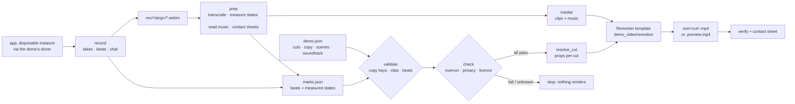

# demo_video/ — product demo videos from a storyboard

Turns screen recordings of an app plus music into a finished, animated demo video (16:9, 1:1 or 4:5), from one `demo.json` storyboard. The renderer is a [Remotion](https://www.remotion.dev/) template driven entirely by data: a new video is a new `demo.json`, not new code. Nothing is published, posted or uploaded.

To make a demo, run the **`/demo-video` skill** in Claude Code from this repo. It follows [`docs/demo-video-runbook.md`](../docs/demo-video-runbook.md) with you, from the message brief to the MP4s. The control panel's 🎬 demo video section shows the same runbook and runs the deterministic stages. This page is the module reference. Built in four steps: #359 renderer, #360 prep and checks, #361 recorder, #362 skill, runbook and tab.



## Run

```powershell
& .\.venv\Scripts\python.exe demo_video_pipeline.py "<demo folder>" --status
& .\.venv\Scripts\python.exe demo_video_pipeline.py "<demo folder>" --stages record,prep,check
& .\.venv\Scripts\python.exe demo_video_pipeline.py "<demo folder>" --cut en-linkedin --preview
& .\.venv\Scripts\python.exe demo_video_pipeline.py "<demo folder>"              # every cut, final 1080p
& .\.venv\Scripts\python.exe demo_video_pipeline.py "<demo folder>" --force      # redo existing outputs
```

| Flag | What |
|---|---|
| `--status` | Validates the storyboard, lists missing media, says which cuts are rendered. Writes nothing; exits 2 on an invalid storyboard or missing media. |
| `--cut <id>` | Only that cut. |
| `--preview` | Half scale, to `out/<cut>.preview.mp4`. About 1¾ min for 83 s. Review with this, not with single stills (Remotion bundles per still, about 40 s each). |
| `--stages` | Any of `record`, `prep`, `check`, `render`, in that order (default `render`). |
| `--force` | Redo outputs that exist: transcodes in `prep`, renders in `render`. |

**Stages:**

- **`record`:**
  - loads the demo's throwaway driver (`recording.driver`, a file in the demo folder) and boots a **disposable** instance of the app;
  - runs every take in real Chrome at 1920×1080, one browser context per page;
  - writes `rec/<lang>/<page>.webm` and the marks file, for each language the selected cuts use. Old measured states are dropped, and `prep` measures them again.

  How to write a driver for a new app: [`docs/demo-video-driver-playbook.md`](../docs/demo-video-driver-playbook.md).
- **`prep`:**
  - transcodes each clip's raw `source` recording to CFR H.264 (when the clip is missing or older);
  - measures every `legend.measure` state timeline into the marks file (`_states`);
  - reads the music into `out/prep/music-<cut>.json`: a per-second loudness envelope, plus the scenes where a closing track (`align_end_tail_s`) builds best;
  - writes a contact sheet per recording (`out/prep/<lang>-<clip>.png`, one frame at the middle of each beat).
- **`check`** runs the hard-stop checks (below) and writes `out/prep/checks.json`. **`render` always runs them first**, so a demo that fails a check never renders (exit 3).
- **`render`:**
  - renders, then writes `out/<cut>.sheet.png` (a frame from the middle of each scene);
  - for a final render, also verifies the file: size, frame rate, length ±1 s, an audio track, and the last second at least 6 dB quieter than the body (the fade).

**Checks:** each one is `pass`, `fail` or `unknown`, and only `pass` lets the run go on.

| Check | Fails when | Why it exists |
|---|---|---|
| `overrun` | A played clip's `offset + seconds × rate` runs past its beat's end. A clip without a beat is checked against its file's length (`unknown` if the file can't be read). | Sped-up clips ran past their beat into the next app screen in the reference video. This check later found two more overruns in it. |
| `privacy` | A roster name, or any of its tokens over 3 letters (accents and case folded), appears in the copy, scenes, product or `privacy.scan` files. A `privacy.blocklist` term appears in the copy of a public cut's language or in the scenes. | Made-up names shared surnames and first names with real participants. |
| `licence` | A `public` cut uses a `private-only` track. | Copyrighted music is fine in a private client cut, never in a public one. |

`privacy`: `{"roster": "<file in the demo folder>", "blocklist": [...], "scan": [...], "allow": [...]}`.
- **Roster:** a `.txt` or `.csv` (first column, `#` comments) or an `.xlsx` with a `name` column. A real roster stays in the demo folder, never in the repo.
- **`allow`:** lists name tokens the owner deliberately accepts, e.g. a common first name.

A final 1080p render takes about 2½–3 min per 83 s cut on this PC.

**One-time setup:** `npm install` in `demo_video/remotion/` (Node.js 20+). `node_modules` is gitignored and lives there, never under OneDrive. The optional `demo_video.node_root` in `config/config.json` points at another install.

## A demo folder

```
<demo folder>/              (outside the repo — OneDrive is fine for this part)
  demo.json                 the storyboard
  marks.json                {video: {beat: [start_s, end_s]}, "_states": {...}} — beats from the recorder (#361), states from prep
  media/                    clips (CFR H.264 .mp4) and music; the `media_dir` field renames it
  out/                      renders, plus out/.props/<cut>.json (the resolved props)
```

The worked example is [`examples/facilitation-suite/`](examples/facilitation-suite/): a synthetic English demo of `facilitation-suite`, 10 scenes, 83 s, three cuts (16:9, 1:1, 4:5). To make it from scratch:
1. Copy the folder somewhere.
2. Point `recording.driver_args.repo` at a facilitation-suite checkout.
3. Put a track at `media/music/en.mp3`.
4. Run `--stages record,prep,check,render`.

## demo.json

| Field | What |
|---|---|
| `title`, `fps` | Name and frame rate (30). |
| `product` | `name`, `icon_paths` (24×24 SVG path data, Lucide-style strokes) and two gradient `colors` for the logo tile. |
| `media_dir`, `marks` | The media folder and marks file, relative to the demo folder; `{lang}` is the cut's language. |
| `clips` | Clip id → `{file, marks?, source?}`: the file (relative to `media_dir`, `{lang}` allowed), its key in the marks file (default: the clip id), and the raw recording `prep` transcodes into it (relative to the demo folder). |
| `privacy` | Roster, blocklist, extra files to scan, accepted tokens (see **Checks**). |
| `recording` | `driver`, `driver_args`, `viewport`, `senders` (+ `sender_step`), `headless`, and `takes` (see **recording** below). |
| `copy` | Language → key → string or list. Every `"@key"` in a scene is replaced by `copy[<cut language>][key]`. |
| `cuts` | `{id, lang, aspect: 16:9 \| 1:1 \| 4:5, public, soundtrack}`. One render per cut. |
| `scenes` | In order; each `{id, type, seconds, fade_s?}` plus its type's fields (below). |

**Clip ref:** `{"video": "stage", "beat": "map", "offset": 2.0, "rate": 1.45, "crop": {x, y, w, h}?}` starts `offset` seconds after the beat's start in that video (or after the video's start without `beat`) and plays at `rate`. `crop` is in source pixels of the 1920×1080 recording.

**Soundtrack track:**

```json
{"file": "music/a.mp3", "licence": "free | private-only",
 "start": 0 | {"scene": "groups", "offset_s": -1.5},
 "end": "end" | {"scene": "groups", "offset_s": 1.5},
 "source_start_s": 12.0 | "align_end_tail_s": 1.0,
 "volume": 0.9, "fade_in_s": 0.5, "fade_out_s": 2.5}
```

- `align_end_tail_s` trims the track's start so it ends that many seconds before its own end, exactly when its window ends. This is how a second track takes the climax to the video's end.
- `licence` is read by the licence check (#360): a `public` cut must not use a `private-only` track.

### recording

```json
"recording": {
  "driver": "driver.py", "driver_args": {"repo": "…"},
  "senders": "@people", "sender_step": 7,
  "takes": [
    {"id": "live",
     "pages": {"presenter": {"url": "/presenter?session={session}", "wait_for": ".p-thumb"},
               "stage": {"url": "/stage"}},
     "setup": [{"act": "clock_start"}, {"wait": 2}],
     "beats": [{"name": "map", "steps": [{"act": "goto", "arg": 2}, {"wait": 1.5}, {"act": "capture_toggle"},
                                         {"chat": "@mapAnswers"}, {"wait": 3}, {"act": "capture_toggle"}]}]}
  ]
}
```

- **A take** is a set of pages recorded together. Each page becomes one video, and its role should match a clip id with `source: "rec/{lang}/<role>.webm"`.
- **`setup` steps** run before the first beat and are not marked.
- **A step** is exactly one of:
  - `act` (+ `arg`): a driver action;
  - `wait` (seconds);
  - `chat`: a list or `@copy` key, posted `every_s` apart (a number, or `[min, max]` seeded by the beat name). The n-th message overall comes from `senders[(n × sender_step) % len]`;
  - `click` (a selector, optionally the row with `text`), `wait_for`, `wheel` `[dx, dy]` × `times`, or `mouse` `[x, y]`, each on a named `page`.
- **Placeholders:** `{name}` in a page `url` or `init_script` is filled from the values the driver's `boot()` returns.

### Scene catalogue

Every scene keeps the reference layout in 16:9. In 1:1 and 4:5 the caption goes on top and the screens go below it:
- in 1:1, two screens sit side by side;
- in 4:5 they stack, with the second one as a picture-in-picture;
- a full-bleed clip becomes a full-width 16:9 band, so nothing in the recording is cropped away.

| `type` | Shows | Fields |
|---|---|---|
| `full_bleed` | A clip filling the frame with a slow zoom, a big caption and chat bubbles popping in | `clip`, `caption`, `zoom`, `focus`, `chat {messages, senders?, sender_step, every_s, start_s, max}` |
| `tiles_statement` | A grid of camera-on meeting tiles with chat bubbles; the caption swaps from `before` to `after` | `tiles`, `chats`, `talkers` (tile index per chat), `before`, `after`, `swap_s` |
| `title_card` | A centred caption | `caption` |
| `brand` | Logo, product name, subtitle | `sub` |
| `steps_device` | A numbered step list next to a device playing a clip; the active step follows the clip | `steps` (`[{title, sub}]`), `step_at` (clip refs where steps 2..n start), `device`, `clip` |
| `split_window_monitor` | What participants see (a meeting window) next to the presenter's monitor | `caption`, `window {label, clip}`, `monitor {label, clip}` |
| `crop_zoom` | A cropped close-up panel of one screen next to a meeting window | `caption`, `panel` (clip ref with `crop`), `window` |
| `side_by_side` | Two or more meeting windows, staggered in | `caption`, `windows`, `stagger_s` |
| `device_caption` | A caption next to a device playing a clip | `caption`, `device` (`laptop` \| `monitor` \| `window`), `clip` |
| `window_states` | A meeting window playing clip segments, with a state legend (e.g. a timer's colours) and a "⏩ ×rate" chip on a sped-up segment | `caption`, `segments [{clip, seconds?}]`, `legend {labels, colors, segment, anchor, changes? \| measure?}`, `speed_chip` |
| `outro` | A blurred clip behind the logo, tagline, product name and footer; fades to black | `clip`, `tagline`, `footer` |

A legend's state change times are either typed (`changes: [[seconds after the anchor beat's start, state], …]`) or **measured**: `measure: {box: {x, y, w, h}, palette: ["#rrggbb", …], step_s}`. `prep` then samples the anchor beat every `step_s`. It classifies the box by the palette colour most of its non-background pixels are nearest to, one colour per state in legend order. Use the colours as they appear on screen, e.g. a paused yellow that the app darkens. On the example, the measured times land within 0.3 s of the ones typed by hand.

A `caption` is `{kicker?, title, sub?, color?, size?, width?}`. Colours are a palette name (`red`, `green`, `yellow`, `blue`, `purple`, `slate`) or any CSS colour; `size` and `width` are 1920×1080 design px. `\n` breaks a line.

## Gotchas

- **Clips must be constant-frame-rate H.264.** Playwright's `.webm` (VP8, variable rate) stutters and seeks badly in `OffthreadVideo`; transcode first (#360 automates it): `ffmpeg -i rec.webm -vf "fps=30,format=yuv420p" -c:v libx264 -crf 14 -g 15 -an clip.mp4`.
- **Remotion copies `media_dir` into its bundle on every render.** Keep only what the demo uses there.
- **Fonts** (Inter, Patrick Hand) load from Google Fonts at render time, so the render needs the network.
- **Remotion's licence** is free for individuals and companies of up to 3 people. `remotion`, `@remotion/cli` and `@remotion/google-fonts` are pinned to the same version.
- **This repo is public.** A private demo's `demo.json`, recordings and music stay in its own folder; the committed example is synthetic.

## Files

| File | What |
|---|---|
| `storyboard.py` | `demo.json` schema (Pydantic), `validate` (copy keys, clips, beats, anchors), `resolve_cut` (props), `missing_media` |
| `render.py` | Writes `out/.props/<cut>.json` and runs the Remotion CLI with node (no `npx.cmd` shell) |
| `prep.py` | The prep stage: transcode sources, measure states, read the music, recording contact sheets |
| `checks.py` | `overrun`, `state_timeline`, `privacy`, `licence`, `run_checks` |
| `record.py` | The record stage: `load_driver`, the beat `Runner`, `record_take`, `run_recording` |
| `media.py` | `Result` (pass / fail / unknown), `transcode`, `loudness_envelope`, `suggest_swaps`, `contact_sheet`, `verify_output`. Every ffmpeg call goes through `podcast/media.py`. |
| `remotion/src/ui.tsx` | Components: `Clip`, `ZoomWindow`, `Monitor`, `Laptop`, `Caption`, `ChatStream`, `Label`, `Logo`, `SceneFade`, `Backdrop`, `Pop` |
| `remotion/src/scenes.tsx` | One component per scene type, landscape and stacked layouts |
| `remotion/src/Demo.tsx`, `Root.tsx` | The scene sequence and soundtrack; one `Demo` composition sized from the props |
| `examples/facilitation-suite/` | The worked example: `demo.json` (with its `recording`), `marks.json`, a synthetic `roster.txt`, and `driver.py`, the reference throwaway driver |
| `../demo_video_pipeline.py` | The CLI |
