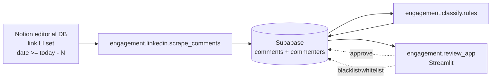

# engagement — anti-AI comment triage

Fourth pipeline in this repo (sibling to `planning/`, `reporting/`, `newsletter/`). Defends my comment threads against AI-generated noise. Two outputs:

1. **Real-comments inbox** — comments worth my personal reply, surfaced in a clean Streamlit view.
2. **AI-triage queue** — staged canned acknowledgements I one-click approve in a batch.

**Never auto-sends.** Every action is staged for explicit approval. See issue [#20](https://github.com/ferraroroberto/reporting/issues/20) for the full design + the public-repo defense-mechanism disclaimer.

## Phase 1 MVP — what's here

- LinkedIn only.
- Scraper that reads my recent posts from the Notion editorial DB (where `link LI` is set) and walks each one in the existing `planning/linkedin/chrome_user_data` session.
- Rules-only classifier (whitelist / blacklist / generic-praise / short / no-personal-token / emoji-only / exact-text-duplicate / sub-2-min-after-post). Tunable via `engagement/classify/phrases.json`.
- Two Supabase tables (`commenters` + `comments`) — see `engagement/db/schema.sql`.
- Streamlit review app — `engagement/review_app.py`.
- No auto-posting worker yet. Approved rows sit in Supabase; you paste the suggested reply manually (one click via `st.code`'s built-in copy button). Phase 2 will add a Playwright send worker.

## Workflow



## CLI

| Command | Purpose |
|---|---|
| `python -m engagement.linkedin.scrape_comments --days 3` | Scrape last 3 days of LI comments → Supabase. Headful by default. |
| `python -m engagement.linkedin.scrape_comments --days 1 --limit 1 --dry-run` | Smoke test against 1 post; writes `results/engagement/dryrun-*.json` instead of upserting. |
| `python -m engagement.classify.rules` | Re-classify all `pending` `unknown` rows using current `phrases.json`. |
| `& .\.venv\Scripts\python.exe -m streamlit run engagement\review_app.py` | Launch the review UI on `http://localhost:8501`. |

## One-time setup

1. Install deps: `& .\.venv\Scripts\python.exe -m pip install -r requirements.txt`
2. Apply schema: open the Supabase dashboard → **SQL Editor** → paste `engagement/db/schema.sql` → **Run**. Idempotent.
3. Make sure `planning/linkedin/chrome_user_data/` exists (the engagement scraper reuses it). If not: `& .\.venv\Scripts\python.exe -m planning.linkedin.bootstrap_session`.

No new secrets needed — uses `config.supabase.service_role_key` and `config.notion.api_token` that the rest of the repo already uses.

## Gotchas

- **Selectors are unvalidated on first run.** The LinkedIn comment-area DOM was never used by the planning composer. `scrape_comments.py` has multiple candidate selectors per concept (`SEL_COMMENT_ARTICLE`, `SEL_COMMENT_TEXT`, etc.) and logs which one matched. If a post returns 0 comments, expect to iterate the selector lists.
- **Headful by default.** Headless would be brittle for first-run selector debugging. Use `--headless` once selectors are validated.
- **Idempotent.** Both tables are upserted on `(platform, comment_id)` and `(platform, account_url)` respectively — safe to re-run on the same posts.
- **Relative time parsing is approximate.** LinkedIn shows `2h`, `5m`, `1d`. We reconstruct an absolute timestamp from scrape time, so `posted_at` drifts up to ~one tick of the LI display unit. Fine for cadence rules.
- **Unknown ≠ AI.** Comments that score below the AI threshold stay `unknown` and surface in the real-comments tab by default. Bias is toward human review — better to over-surface than wrongly stage a canned reply.
- **Whitelist/blacklist cascades.** Marking a commenter triggers a retroactive reclassification of their pending comments (`cascade_blacklist_pending` / `cascade_whitelist_pending`).
- **No tests yet.** Single-user pipeline; verification is a real scrape + manual eyeball.

## Files

```
engagement/
├── __init__.py
├── README.md                         # this file
├── linkedin/
│   └── scrape_comments.py            # Notion → LI post URLs → comment DOM → Supabase
├── classify/
│   ├── rules.py                      # rule pipeline + verdict writer
│   └── phrases.json                  # generic-praise list, weights, thresholds, reply templates
├── db/
│   ├── client.py                     # supabase-py + notion client + CRUD helpers
│   └── schema.sql                    # one-time DDL for commenters + comments
└── review_app.py                     # Streamlit UI
```

## Config block (in `config/config.json`)

```json
"engagement": {
    "default_days": 3,
    "phrases_path": "engagement/classify/phrases.json",
    "platforms_enabled": ["linkedin"],
    "linkedin": {
        "expand_max_clicks": 30,
        "expand_settle_ms": 1200,
        "page_settle_ms": 2500
    }
}
```

## Next phases

- **Phase 2** — small sklearn classifier (logreg/gradient boost) trained on accumulated whitelist/blacklist labels; Playwright send worker that posts approved replies with jitter.
- **Phase 3** — LLM fallback (Gemini Flash-Lite / Haiku 4.5) for the ambiguous middle; rolling reputation_score recomputation.
- **Phase 4** — Instagram, then Twitter, Threads, Substack.
- **Phase 5** — cross-platform identity linking + retroactive blacklist propagation.
