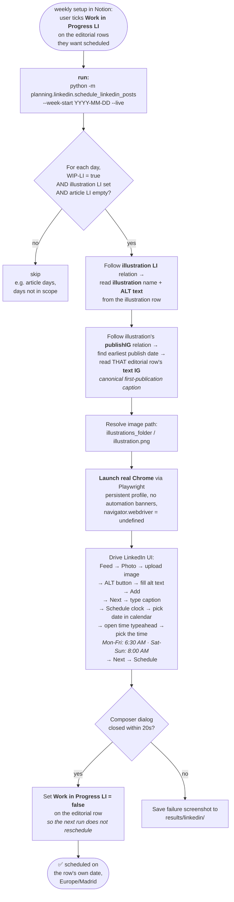

# LinkedIn Planning Automation

Plays back the weekly LinkedIn-scheduling routine via Playwright + real Chrome. Reads upcoming days from the Notion editorial database, drives LinkedIn's native "Schedule for later" flow, and posts nothing automatically — it only places already-written content into LinkedIn's own scheduler.

**This is a planner, not a bot.** No likes, comments, follows, or DMs are automated. The script only schedules the user's own pre-written, already-illustrated posts.

---

## Workflow



---

## Setup (one-time)

```powershell
& .\.venv\Scripts\python.exe -m planning.linkedin.bootstrap_session
```

A real-Chrome window opens at LinkedIn's login page. Log in manually, then return to the terminal and press **Enter**. The session is persisted under `linkedin/chrome_user_data/` (gitignored; **separate** from your normal Chrome profile).

The bootstrap uses the same stealth flags as every other run (see `config/chrome_launch.py`) so the login Chrome looks identical to a hand-driven session — no automation infobar, `navigator.webdriver` is undefined.

---

## Daily / weekly use

```powershell
# default = dry-run, default week = next Monday
& .\.venv\Scripts\python.exe -m planning.linkedin.schedule_linkedin_posts

# explicit dry-run for a chosen week
& .\.venv\Scripts\python.exe -m planning.linkedin.schedule_linkedin_posts --week-start 2026-05-25 --dry-run

# go live for the whole week
& .\.venv\Scripts\python.exe -m planning.linkedin.schedule_linkedin_posts --week-start 2026-05-25 --live

# single-day mode (testing)
& .\.venv\Scripts\python.exe -m planning.linkedin.schedule_linkedin_posts --date 20260518 --live

# override the idempotency guard
& .\.venv\Scripts\python.exe -m planning.linkedin.schedule_linkedin_posts --date 20260518 --live --force
```

| flag | meaning |
|------|---------|
| `--week-start YYYY-MM-DD` | Monday of the target week. Default: next Monday from today. |
| `--date YYYYMMDD` (or `YYYY-MM-DD`) | Single-day mode; overrides `--week-start`. |
| `--dry-run` / `--live` | `--dry-run` walks the flow up to the Schedule dialog, screenshots, then cancels. `--live` actually schedules. Default is `--dry-run` (set via `linkedin.dry_run_default` in `config.json`). |
| `--force` | Schedule even if the editorial row's `link LI` column is already populated. |
| `--debug` | Verbose logging. |

Screenshots, success/failure artifacts, and per-row dry-run images land in `results/linkedin/`.

---

## What gets scheduled, what doesn't

A row in `--week-start`'s 7-day range is **in scope** when ALL of:

1. `Work in Progress LI` checkbox = true
2. `illustration LI` relation is non-empty
3. `article LI` relation is empty (article days are a future Phase 2; not in this script)

In-scope rows are scheduled in local time (Europe/Madrid) on the row's own date:

- **Mon-Fri** → 06:30 (`schedule_hour_local` / `schedule_minute_local`)
- **Sat-Sun** → 08:00 (`schedule_weekend_hour_local` / `schedule_weekend_minute_local`)

Days with nothing checked are silently skipped.

### Idempotency — running twice is safe

The script will not double-schedule. Two layers of protection:

1. The Notion query filter is `Work in Progress LI = true` — only ticked rows are even considered.
2. After a successful **live** schedule, the script writes `Work in Progress LI = false` on that editorial row, so a subsequent run no longer matches it in the filter.

In practice: run `--live` twice for the same week and the second run will report "Nothing to do" for every row that was scheduled by the first run. Failed rows keep their tick and will be retried on the next run.

The `link LI` column is also checked (rows where it's populated are skipped unless `--force`), but that URL is harvested by the existing notion_update pipeline only **after** LinkedIn publishes the post — so the WIP-LI untick is the primary idempotency guard at scheduling time.

---

## Notion fields used

All field names come from `config/config.json` `linkedin.editorial_columns` and `linkedin.illustration_columns` — never hardcoded in the script.

**Editorial DB (`ee23dec3...`):**

| role | column | type | purpose |
|------|--------|------|---------|
| `title_day` | `day` | title | Row's day in `YYYYMMDD`. |
| `wip_checkbox` | `Work in Progress LI` | checkbox | The scope marker; auto-unticked after live schedule. |
| `illustration_rel` | `illustration LI` | relation | Points to the source illustration row. |
| `article_rel` | `article LI` | relation | If non-empty, row is skipped (article days = Phase 2). |
| `post_url` | `link LI` | url | Idempotency check; not written by this script. |
| `caption_text` | `text IG` | rich_text | The per-day Instagram caption. Read on the earliest `publishIG`-related row to get the canonical first-publication caption. |

**Illustrations DB (`f700...`):**

| role | column | type | purpose |
|------|--------|------|---------|
| `image_filename` | `illustration` | title | Image filename (no extension); `.png` is appended. |
| `alt_text` | `ALT text` | rich_text | LinkedIn ALT text for the image. |
| `publish_relation` | `publishIG` | relation | All editorial rows where this illustration has been published. |
| `caption_fallback` | `text IG to copy` | formula | Only used as fallback when `publishIG` is empty (illustration never published before). |

### Why the caption goes through `publishIG`, not `text IG to copy`

The illustration's `text IG to copy` formula concatenates **every** caption ever written for that image across all reuses. For an image published 3 times this yields a multi-version, comma-joined mess. The script instead follows `publishIG` → sorts by day ascending → reads the earliest editorial row's `text IG` rich_text. That's the single canonical first-publication caption.

If an illustration has never been published before (empty `publishIG`), the script falls back to `text IG to copy` — which in that case has nothing to concatenate, so it's safe.

---

## How the browser session is hardened against bot detection

Single source of truth: `config/chrome_launch.py`. Every per-platform module (`substack/`, `linkedin/`, future `twitter/` / `threads/` / `instagram/`) imports `stealth_launch_kwargs` and `STEALTH_INIT_SCRIPT` from there. No automation tells are inlined elsewhere.

What it does:

- **Real Chrome** (`channel="chrome"`), not bundled Chromium. Chromium is fingerprinted instantly by reCAPTCHA / LinkedIn-style anti-bot.
- **Persistent profile** under `linkedin/chrome_user_data/` (separate from your real Chrome). Login cookies survive across runs.
- **`ignore_default_args`**: strips `--enable-automation` (kills the "Chrome is being controlled by automated test software" yellow infobar), `--enable-blink-features=IdleDetection` (another fingerprintable tell), and `--no-sandbox` (kills its own complaint banner).
- **`--disable-blink-features=AutomationControlled`**: lower-level handling of `navigator.webdriver`.
- **`STEALTH_INIT_SCRIPT` via `add_init_script`**: belt-and-braces — explicitly redefines `navigator.webdriver` to `undefined` before any page script runs.
- **`--disable-features=Translate`, `--no-default-browser-check`, `--no-first-run`**: removes the other ambient popups that look like an unattended Chrome.

---

## Files in this package

| file | what it does |
|------|--------------|
| `bootstrap_session.py` | One-time interactive login. Opens real Chrome at LinkedIn's sign-in page; after you log in, pressing Enter saves the session to the persistent profile. |
| `linkedin_session.py` | `LinkedInSession` context manager: launches the persistent-profile real-Chrome session and exposes `page` + a `screenshot_failure()` helper. Equivalent to `substack/substack_session.py`. |
| `schedule_linkedin_posts.py` | The scheduler. Queries Notion, follows relations, drives the UI, writes back the WIP-LI untick. |
| `chrome_user_data/` | (auto-created, gitignored) The dedicated Chrome profile. |
| `README.md` | This file. |

Cross-module dependencies:

- `notion/editorial.py` — shared Notion helper used by every platform (`get_row_by_day`, `query_rows_by_filter`, `get_field`, `set_field`, `retrieve_page`).
- `config/chrome_launch.py` — shared stealth launch flags.
- `config/logger_config.py` — shared logger setup.

---

## Selectors used in the LinkedIn UI

LinkedIn's class names are obfuscated (`_6e37ba57`, `_876da3c4`, …) and rotate — never anchor on classes. These role/text-based selectors are the validated ones; full details in the `reference_linkedin_composer_selectors` memory entry.

| step | selector |
|------|----------|
| Open post + file picker | `page.get_by_role("button", name=/^photo$/i)` on the feed |
| Upload image | `input[type="file"]` (first; appears in DOM after "Photo" click) |
| Open ALT dialog | `[role="dialog"] >> get_by_role("button", name=/alternative text/i)` |
| ALT textarea | `textarea[placeholder*="describe this image" i]` |
| Close ALT dialog (Add) | `[role="dialog"] >> get_by_role("button", name=/^add$/i).last` |
| Editor → composer (Next) | `[role="dialog"] button:has-text("Next")` |
| Caption editor | `div[role="textbox"][contenteditable="true"]` (then `page.keyboard.type(...)`) |
| Open Schedule dialog | `get_by_role("button", name=/^schedule post$/i)` |
| Set date | Click `input[name="artdeco-date"]` → click calendar day by aria-label like `Monday, May 18, 2026.` |
| Set time | Click `input[name="timepicker"]` → wait for `.artdeco-typeahead__results-list:not([data-count="0"])` → click `li:has-text("<H>:<MM> <AM/PM>")` (e.g. `6:30 AM` Mon-Fri, `8:00 AM` Sat-Sun) |
| Schedule sub-dialog → composer | `[role="dialog"] button:has-text("Next")` |
| Final Schedule button | `[role="dialog"] >> get_by_role("button", name="Schedule", exact=True)` |
| Success signal | The composer dialog disappears within ~20s |

---

## Gotchas (learned the hard way)

- **Don't press `Escape`** inside the composer or its sub-dialogs. It bubbles up to the composer and triggers a "Save this post as a draft?" prompt that then blocks every following click. Use direct element interactions (calendar click, typeahead click) instead.
- **`get_by_role("button", name="Schedule")` is dangerous without `exact=True`** — without it, the matcher also hits the small `aria-label="Schedule post"` clock icon, which just re-opens the schedule dialog.
- **The time picker is a typeahead combobox.** Typing "6:30 AM" silently selects whichever option was first highlighted (often 12:30 AM). Always click the matching `<li>` from the dropdown.
- **There is no standalone URL for the scheduled-posts list.** Every `/scheduled-posts/`-style URL 404s. The list is a modal sheet reachable only via the post composer's Schedule dialog → "View all scheduled posts" → Discard the in-progress draft.
- **Carousel "Next" buttons on the feed** behind the modal have `aria-label="Next"` but empty visible text. Scope to `[role="dialog"] button:has-text("Next")` so they don't win the `.first` race.
- **Don't trust a fixed `wait_for_timeout` + screenshot as success confirmation.** The composer briefly stays open while LinkedIn renders the schedule, then unmounts. Wait for the dialog to actually disappear.

---

## Deleting / inspecting a scheduled post (manual recipe)

From a logged-in LinkedIn tab:

1. Click **Photo** in the feed share-box, upload anything (a placeholder image).
2. Click **Next** → type any text.
3. Click the **clock** icon (Schedule post) at the bottom of the composer.
4. In the Schedule dialog, click **View all scheduled posts** (top-left of the dialog).
5. LinkedIn asks "Save this post as a draft?" — click **Discard**.
6. The Scheduled posts sheet opens. Each row has a `...` (actions menu) on the right → Delete post → confirm.

---

## Replication template for other platforms

`substack/` already exists. `twitter/`, `threads/`, `instagram/` need the same shape:

```
<platform>/
├── __init__.py
├── README.md
├── bootstrap_session.py
├── <platform>_session.py
├── schedule_<platform>_posts.py
└── chrome_user_data/        (gitignored)
```

Each new platform must:

- Import `stealth_launch_kwargs` + `STEALTH_INIT_SCRIPT` from `config/chrome_launch.py`. Never inline launch args.
- Use `notion/editorial.py` for all Notion access.
- Add a `<platform>` block to `config/config.json` with the platform-specific URLs and `editorial_columns` + `illustration_columns` role maps (the relevant `Work in Progress <XX>` checkbox, `link <XX>` URL, etc.).
- Add `<platform>/chrome_user_data/` to `.gitignore`.

The IG-first caption rule applies across the board: LinkedIn, Twitter, Threads and Instagram all reuse the canonical first-publication caption read via `publishIG`. Adjust per-platform only what differs (filter field, schedule UI flow).
