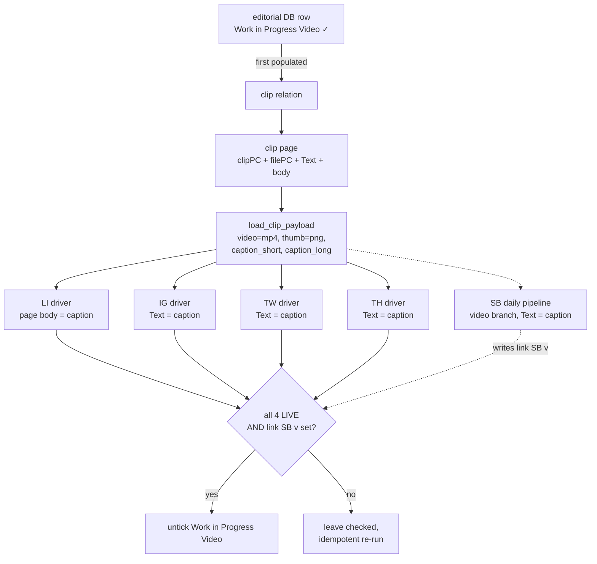

# `planning/videos/` — weekly cross-platform video orchestrator

Schedules **one weekly video clip** across LinkedIn, Instagram, Twitter, and
Threads at **19:00 Europe/Madrid** on the editorial row's date. Substack is
posted by the **daily Substack pipeline** on the video day (no native
scheduler) via a branch added to `planning/substack/daily_pipeline.py`.

## Pipeline

## CLI

| Command | Effect |
|---|---|
| `python -m planning.videos.schedule_videos_posts --all-wip --dry-run --debug` | Smoke test: walk each platform up to the schedule step, save screenshots under `results/videos/`, do NOT submit. |
| `python -m planning.videos.schedule_videos_posts --all-wip --live` | Schedule on every WIP-Video row across LI / IG / TW / TH. |
| `python -m planning.videos.schedule_videos_posts --date 20260512 --live` | Single-day mode (only that row's video). |
| `python -m planning.videos.schedule_videos_posts --all-wip --live --skip-li --skip-th` | Schedule only the platforms not flagged with `--skip-*`. |
| `python -m planning.videos.schedule_videos_posts --all-wip --live --force` | Schedule even if `link 
(v)` is already populated. |
| `python -m planning.substack.post_substack_video_note --date 20260512 --live --force` | Standalone Substack video-note publish (also invoked automatically by the daily pipeline on video days). |
| `python planning_pipeline.py --live` | Full planning orchestrator: LI → IG → TW → TH → **Videos** (Videos runs last). |

## Notion fields read

### Editorial DB (one row per day)

| Role | Column | Used for |
|---|---|---|
| `title_day` | `day` | YYYYMMDD title, parsed to date |
| `wip_checkbox` | `work in progress Vd` | Filter rows to process; unticked only when all platforms done. (NOT `video` — that's a separate "has video" flag set on every weekly-video row historically.) |
| `clip_rel_
` | `clip LI(v)`, `clip IG(v)`, `clip TW(v)` | Per-platform in-scope flag; orchestrator follows first populated relation to the shared clip page. Threads is not in scope — no `clip TH(v)` column exists. |
| `post_url_
` | `link LI(v)`, `link IG(v)`, `link TW(v)` | Idempotency: skip already-scheduled. After scheduling, a sentinel URL `https://scheduled.local/
/<day>` is written until the data-collection pipeline overwrites with the real post URL. |
| `post_url_sb` | `link SB` (shared with image-note flow) | Substack coordination. The daily Substack video-note branch writes the real Substack URL here on video days; the orchestrator reads it to decide whether to untick `work in progress Vd`. |

### Clip DB (one clip per weekly video)

| Role | Column | Used for |
|---|---|---|
| `caption_text` | `Text` (property) | Short caption for IG / TW / TH / SB |
| `caption_li` | `TextLI` (property — rich_text) | Cached LinkedIn long caption. If empty, orchestrator reads page body via API and writes the result here so subsequent reads (and the human) get it cheaply. |
| (page body) | A single `code` block, language `plain text` | Source of truth for the LinkedIn long caption. Authored as a code block so emoji and whitespace survive verbatim. Orchestrator copies into `TextLI` automatically. Strict: if both `TextLI` and the body are empty, the LI driver fails. |
| `clip_pc` | `clipPC` | Folder path (already terminated with `\`) |
| `file_pc` | `filePC` | Bare filename without extension |

Video file = `<clipPC><filePC>.mp4`. Thumb = `<clipPC><filePC>.png` (LinkedIn auto-extracts a thumbnail; the .png is logged-and-skipped if missing).

## Selectors per platform

Reused from the sister image-flow modules — no new selector logic was
introduced beyond the LinkedIn `Video` button and the Substack video-icon
attach helper. See:

- LinkedIn: `planning/linkedin/schedule_linkedin_posts.py` — composer
  + ALT skipped (videos have no ALT in LI), `Video` button instead of
  `Photo`. The video Editor mounts a hidden
  `input#media-editor-file-selector__file-input` with
  `accept="...video/mp4..."` — `_upload_video` pushes the .mp4 directly
  at that input (the visible blue "Upload from computer" button is
  decorative and intercepted by a styled `
` overlay; clicking it
  errors out). Then `_wait_for_video_ready` polls the `Next` button's
  enabled-state for up to 180s (LI transcoding window). The caption is
  typed via `fill_caption_with_mentions` (imported from
  `planning/linkedin/linkedin_composer.py` — shared with the LinkedIn
  POST + CAROUSEL flows), which detects every `@CapitalizedName` (or
  `@First Last`) in the body and resolves it through LinkedIn's
  typeahead dropdown (see Gotchas). After the final Schedule click,
  `wait_for_upload_complete` (same shared module) keeps the browser open
  until LinkedIn's background video upload settles (also see Gotchas).
- Instagram (Meta planner): `planning/instagram/schedule_instagram_posts.py`
  — same `Schedule post` menu, same FileChooser-intercept upload (accepts
  .mp4), same `Set date and time` toggle + split hours/minutes/meridiem.
  After upload the driver waits a short 2-second head-start, fills the
  caption + date/time, then **polls the Schedule button's
  `aria-disabled` attribute** (via `wait_action_button_enabled`, shared
  helper in the IG planner module) for up to 90 s before clicking.
  Meta keeps the Schedule control disabled until the .mp4 finishes
  server-side transcoding; a fixed sleep is not reliable.
- Twitter (X): `planning/twitter/schedule_twitter_posts.py` — same
  `SideNav_NewTweet_Button`, same `fileInput` (accepts .mp4 directly),
  same `scheduleOption` + 6 native selects.
- Threads: `planning/threads/schedule_threads_posts.py` — same
  composer modal, same `_open_three_dots_menu` → `Schedule…`, same
  calendar/time inputs + `Done` → final `Schedule`.
- Substack video note (in `post_substack_video_note.py`): `_open_note_composer`
  reused from the image flow; image-attach helper replaced with a
  direct push at the composer's pre-mounted
  `input[type=file][accept*="video"]`. (Substack pre-mounts TWO hidden
  file inputs — image and video — distinguished only by `accept` MIME
  list. The visible toolbar icons have no aria-label / title / testid,
  so targeting buttons by attribute fails; pushing files at the typed
  input is the robust path.) Preview wait keys on the composer's
  `<video>` element having a `src` (180s budget).

## Gotchas

- **`clipPC` ALREADY has a trailing slash** — the orchestrator concatenates
  `<clipPC><filePC>.mp4` directly. Don't pre-normalize the folder path or
  the file lookup will fail.
- **Per-platform `clip 
(v)` relations must all point to the SAME clip
  page.** The orchestrator follows the first populated one and reuses the
  payload for every platform. If you want a platform out of scope, leave
  its `clip 
(v)` empty (orchestrator marks it `SKIP`).
- **WIP-Video coordinates with the daily Substack pipeline.** The
  orchestrator only unticks `Work in Progress Video` when all four scheduled
  platforms succeed AND `link SB(v)` is populated. The daily pipeline writes
  `link SB(v)` when it posts the SB video note. Either component can run
  first; the *next* run of the orchestrator closes the loop. Re-running the
  orchestrator after SB has posted is the canonical idempotent path — the
  four already-scheduled platforms are skipped via `link 
(v)` presence,
  and the untick fires.
- **No new Chrome profile.** Drivers import their sister-platform sessions
  (`LinkedInSession`, `InstagramSession`, `TwitterSession`, `ThreadsSession`),
  so they reuse `planning/
/chrome_user_data/`. Bootstrap each sister
  package as usual; videos needs no `bootstrap_session.py` of its own.
- **LinkedIn long caption is strict.** The clip page body MUST be non-empty;
  the LI driver raises if it is. No fallback to the short `Text` property
  (per user spec — silent fallback would mask editorial omissions). The
  body's `paragraph` / `heading_*` / `quote` / `callout` / list-item / `to_do`
  / `toggle` block types are joined with newlines via
  `reporting.notion.editorial.get_page_body_text`.
- **`--skip-
` does NOT count as success for WIP untick.** The
  orchestrator distinguishes SKIP-via-flag (don't untick) from
  SKIP-via-idempotency (`link 
(v)` populated → untick OK) and
  SKIP-out-of-scope (clip relation deliberately empty → untick OK).
  Re-running with `--skip-li` will leave WIP-Vd checked so you can come
  back to LI later.
- **Threads has no `link TH(v)` column → no link-based idempotency.**
  TH is included via the `PLATFORMS_TAG_ALONG` set: in scope whenever
  any other clip relation is populated. The orchestrator can't write a
  sentinel for TH (no column), so re-runs with WIP-Vd still True would
  attempt to re-schedule TH. The orchestrator unticks WIP-Vd as soon as
  TH (and the other platforms) succeed once, which prevents accidental
  double-scheduling in practice — but if you re-tick WIP-Vd later
  without first deleting the existing scheduled Threads post, you'll
  get a duplicate. The post-LIVE sentinel-write loop in
  `schedule_videos_posts.py` explicitly skips platforms in
  `PLATFORMS_TAG_ALONG` (see issue #29) so successful TH runs don't
  log a misleading `"Role 'post_url_th' not present"` warning — that
  warning is reserved for *real* `editorial_columns` regressions
  (e.g. a `post_url_li` entry accidentally deleted from `config.json`).
- **LinkedIn keeps uploading the video AFTER the composer closes.** The
  composer disappears as soon as `Schedule` is clicked, but LinkedIn
  finishes the .mp4 upload in the background. If the Playwright context
  tears down before that completes, the scheduled post is created with
  no media and opening the scheduled-post detail in the LI Scheduled
  sheet shows *"Something went wrong, please try reloading the page"*.
  The driver calls `_wait_for_upload_complete(page)` after every
  successful Schedule. It hunts several in-progress indicator candidates
  (`div[aria-label*="upload" i]`, `div[role="status"]:has-text("Uploading")`,
  `div:has-text("don't close")`, `div:has-text("video is uploading")`,
  `div.global-alert`, `[data-test-global-alert-id]`); if any appear it
  polls until they disappear (cap 7 min) plus a 3-second safety buffer;
  if none ever appear it falls back to a **60-second hold** so a slow
  background upload still has a chance to land. Bump the fixed hold (or
  add a new candidate selector) if you ever see "Something went wrong"
  on a row the driver reported `LI:LIVE`. The mention-resolution helper
  (`fill_caption_with_mentions`, shared via
  `planning/linkedin/linkedin_composer.py`) types each `@Name` literal
  then waits for LI's typeahead and clicks the matching person via a
  list of candidate selectors (`div.mentions-typeahead-content [role="option"]`,
  `[data-test-id="mentions-typeahead"] [role="option"]`,
  `[aria-label*="mention" i] [role="option"]`,
  `.artdeco-typeahead__results-list li`, generic
  `[role="listbox"] [role="option"]`). Failure to resolve a mention
  doesn't fail the row — the `@<Name>` stays as literal text and a
  warning is logged.
- **Mention chip eats the following space (validated 2026-05-17).**
  Clicking the LI typeahead suggestion absorbs the immediately-following
  SPACE keystroke, fusing the next word into the chip
  (`@Michelle Kempton says` → `Kemptonsays`). This bug was invisible
  in the videos flow until now because the canonical clip captions had
  a `\n\n` immediately after each `@Name` (newlines are NOT absorbed,
  only spaces are). `fill_caption_with_mentions` now peeks at the next
  source char and types one compensating space when it's whitespace or
  alphanumeric — newlines and punctuation pass through untouched. A
  future video caption with `@Name word` (no newline) will render
  correctly with no code change needed in `videos_linkedin.py`. See
  `planning/linkedin/README.md` *"Quirk: mention chip eats the
  following space"* for the full table of source-char → behaviour.
- **Sentinel post URL.** After a LIVE schedule the orchestrator writes
  `https://scheduled.local/<platform>/<day>` into `link 
(v)`. This is
  intentional and gets overwritten by the data-collection pipeline once the
  real post goes live.

## Files

- `__init__.py` — empty package marker.
- `videos_session.py` — config loader, Notion token loader, `ClipPayload`
  dataclass, `load_clip_payload(notion, editorial_row, video_cols, clip_cols)`.
- `schedule_videos_posts.py` — orchestrator entry point. Implements the
  `main() -> tuple[int, list[dict]]` contract consumed by
  `planning_pipeline.py`.
- `videos_linkedin.py` / `videos_instagram.py` / `videos_twitter.py` /
  `videos_threads.py` — per-platform drivers, each exposing
  `run(rows, video_cfg, *, dry_run) -> list[dict]`.

The Substack branch lives in
`planning/substack/post_substack_video_note.py` (not under `planning/videos/`)
because it's invoked by the daily Substack pipeline, not by the videos
orchestrator.
