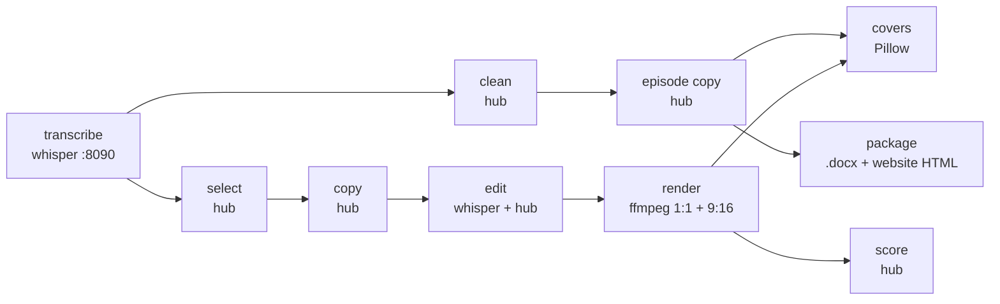

# podcast/ — episode package pipeline

Turns one raw two-track interview recording (Riverside: one video per speaker)
into the full episode package, locally. Nothing is published, posted,
scheduled or written to Notion. The only Notion access is a read of the Clips
table for past titles and LinkedIn intros (style examples).



## Run

```powershell
& .\.venv\Scripts\python.exe podcast_pipeline.py "<episode folder>"
& .\.venv\Scripts\python.exe podcast_pipeline.py "<episode folder>" --stages render,covers --force
```

Or from the control panel's 🎙️ podcast tab: pick the episode, run, then review
each clip (both crops, the cover, the copy and its score), the cost table and
the package files.

Each stage writes into `<episode folder>/podcast package/` and is skipped when
its output already exists, so a run that dies resumes where it stopped.
`render` and `covers` are only "done" once every clip has its files, and they
keep the clips already on disk. `--force` redoes the selected stages.

## The episode folder

The episode facts are private, so they live next to the recording in an
`episode.json`, never in this repo:

```json
{
  "guest": "Full Name", "guest_display": "Dr. Full Name", "guest_first": "Full",
  "guest_pronoun_possessive": "her",
  "tracks": {"guest": "video editing/<guest track>.mp4", "host": "video editing/<host track>.mp4"},
  "host_is_interviewee": false,
  "start_s": 196,
  "adjective": "brilliant", "date": "2024-03-28",
  "website_slug": "full-name", "youtube_url": "",
  "links": [{"label": "LinkedIn", "url": "https://..."}]
}
```

`tracks.host` is always the owner's own track, whoever asks the questions.
`host_is_interviewee: true` switches the clip and episode copy to first
person. `start_s` / `end_s` trim the pre-show chat before clip selection (the
cleaned transcript also starts there). The other keys are documented in
[`episode.py`](episode.py).

## Outputs

| Path in `podcast package/` | What |
|---|---|
| `transcript/words.json`, `turns.json`, `raw transcript.md` | word-timed transcript, both speakers |
| `transcript/clip_words.json` | each clip's caption words, review fixes applied |
| `<guest> - <host> - transcript.md` / `.txt` | the cleaned reading transcript |
| `clips.json`, `clips.md` | the 15 clips: times, title, Instagram caption, LinkedIn post, score, the edit (kept spans, 1:1 shots) and the caption review (scores, fixes, doubts) |
| `clips/1x1/`, `clips/9x16/`, `clips/covers/` | the rendered clips and their cover images |
| `episode_copy.json` | YouTube, website and thumbnail copy |
| `<guest> - <host>.docx` | the episode document (YouTube, clips, thumbnails, website text, links, thank-you note) |
| `<guest> - <host> - website.html` | the "Inspiring conversations" page, paste-ready for the site's text block |
| `<guest> - <host> (1920x1080)_thumbnail.png`, `_text.png` | the episode covers |
| `metrics.json`, `metrics.md`, `scores.json` | per-stage cost table and per-clip quality scores |

Large intermediates (WAVs, frames, caption files) go to `podcast.work_dir`
(default: the system temp folder), not to OneDrive.

## Stages

- **transcribe**: each track goes to the whisper server on its own. Each
  microphone also hears the other speaker, so frames where the other track
  is much louder are muted first (the bleed gate). Whisper segments sitting on
  muted audio are dropped. A window where a 5-word phrase repeats 4+ times
  within two minutes is re-transcribed from the ungated audio: a whisper
  decoder loop repeats far more often than that, while real speech can repeat
  three times. Sub-word tokens (`" don"` + `"'t"`) are joined into words.
- **select**: the model sees numbered sentences and answers with sentence-id
  ranges, so every cut lands on a sentence boundary. Candidates that are too
  short, too long or overlapping are dropped in rank order.
- **copy**: title (lowercase, at most 5 words), LinkedIn hook + body + the
  fixed credit line and footer, and the templated Instagram caption.
- **edit**: per clip, the edit decisions. Caption words come from a whisper
  pass over the clip's own mixed audio (where both people talk at once the
  per-track pass can lose a sentence and drift seconds behind). An LLM then
  reviews every caption word in context (the minutes around the clip, the
  episode topic) and corrects what was misheard ("aim for hate" → "eight"
  in a talk about sleep); only fixes it is sure of are applied, guesses are
  listed as doubts. Jump cuts: silences are found on the audio, a pause over
  0.4 s shrinks to 0.24 s, a leading "And…/So, yeah…/But then…" is cut, and
  a short sound between two silences is cut as a filler when its words are
  fillers or when, carrying no word, an isolated decode hears only a filler
  (whisper writes almost no "um", and most such sounds turned out to be
  real words). The 1:1 camera plan follows whoever speaks (the louder
  track, for a turn of 1.5+ s of speech) and changes framing (punch in/out) at a jump cut or
  after 6 s on one framing.
- **render**: plays each clip's kept spans back to back, every audio span
  with a 10 ms fade in and out so cuts don't click, cut on the same 24 fps
  frames as the picture. 1:1 is each shot's speaker full frame at its
  framing; 9:16 stacks the owner on top of the guest. Captions are burned
  in (ASS), karaoke style: Sora ExtraBold, white with a black outline, a
  few words on screen and each word turning `#FDEC01` as it is said. H.264,
  loudness-normalised.
- **covers**: the episode thumbnail and text card, then one cover per clip:
  a frame from the first kept shot of the clip's speaker, so a cut opener
  never becomes the cover. The `.docx` and `clips.md` give each clip's cut
  length once it is edited.
- **score**: per clip, 1 to 5 on the rubric: hook in the first 3 s of the
  cut clip and self-contained idea (hub, text), caption accuracy (the
  review's score after its fixes; the word error rate against the
  independent per-track pass is kept as a hint), and framing of both crops
  (hub, one frame each; captions on the 9:16 seam are the house style and
  are not judged).

## Config (`config.json` → `podcast`)

`episodes_root`, `whisper_url`, `llm_hub_base_url`, `models` (hub alias per
role: `clean`, `select`, `copy`, `caption_review`, `episode_copy`, `score`),
`llm_rates_usd_per_mtok` (list prices for the cost table: the hub runs
on the subscription, so the cost is a metered-API equivalent),
`clips_per_episode`, `clip_min_s` / `clip_max_s`, `video_encoder`, `fonts`,
`host` (name, headshot, brand mark), `linkedin_footer`, and
`notion.clips_db_id` for the style examples. See `config/config_example.json`.
